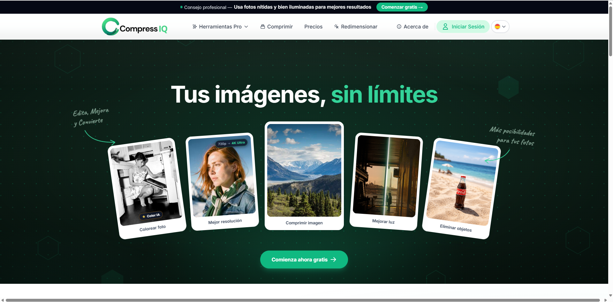
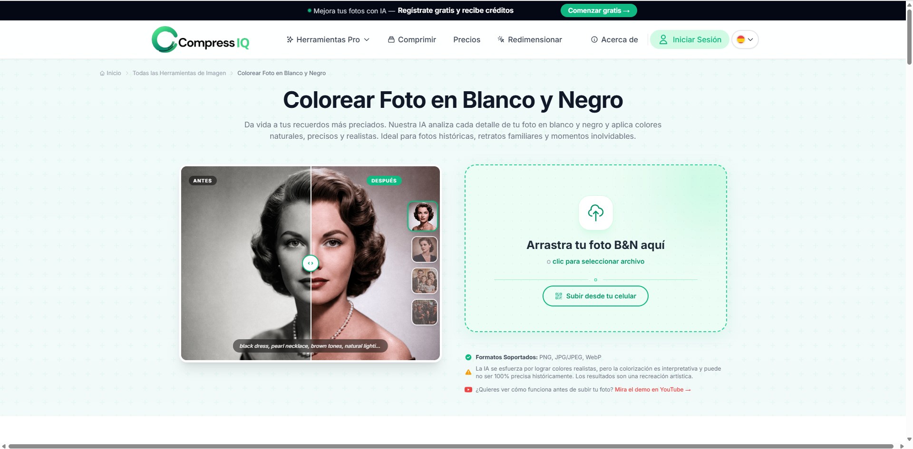
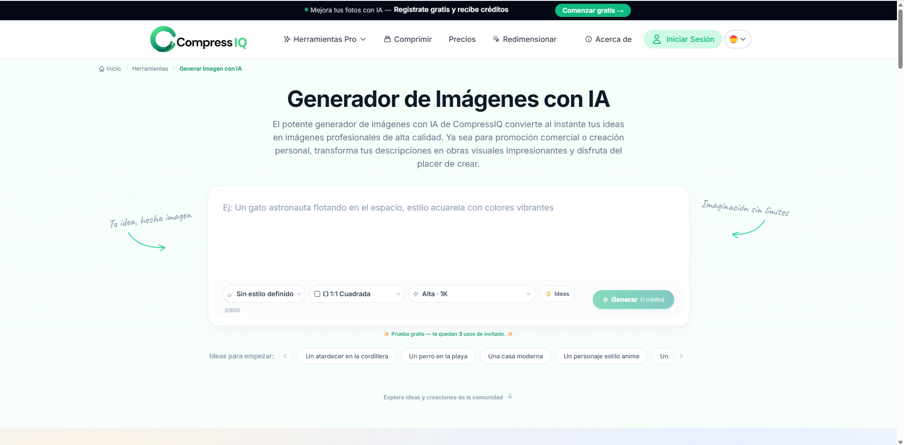
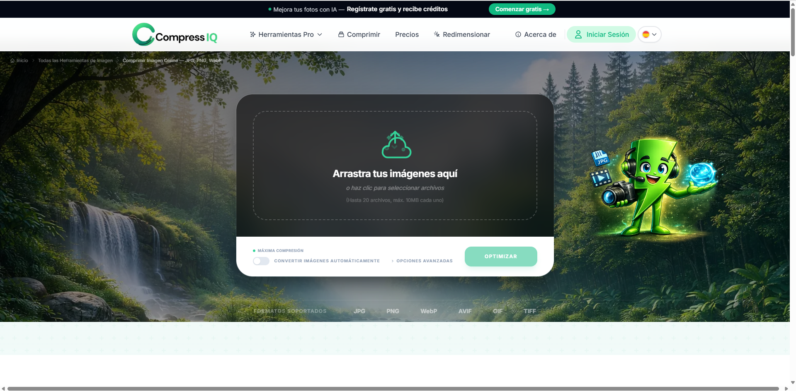
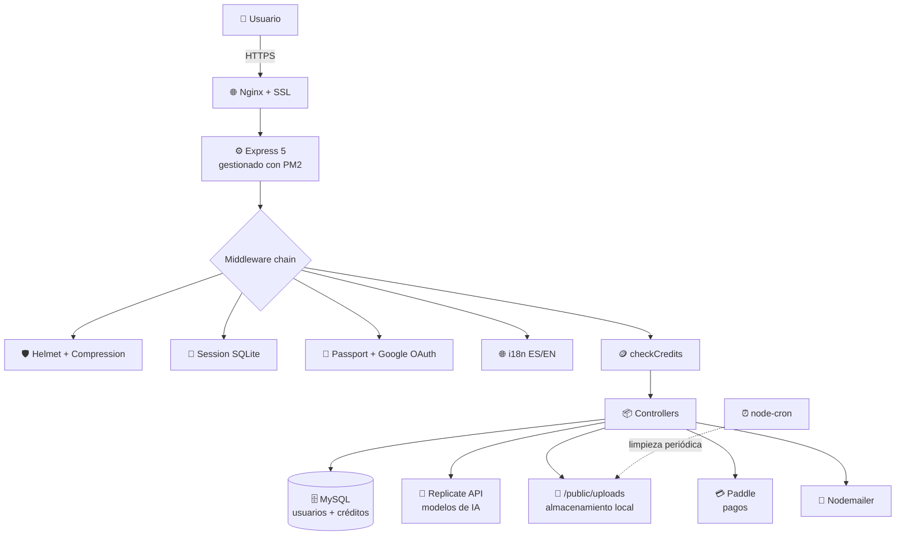

<h1 align="center">🖼️ Compress IQ</h1>

<p align="center">
  <strong>Plataforma SaaS de edición de imágenes impulsada por Inteligencia Artificial</strong><br/>
  <em>Edita, mejora, convierte y transforma tus imágenes con IA</em>
</p>

<p align="center">
  <a href="https://compressiq.com">
    
  </a>
</p>

<p align="center">
  
  
  
  
  
</p>

<p align="center">
  
</p>

---

## 📖 Sobre el proyecto

**Compress IQ** es un SaaS de edición de imágenes construido desde cero, en producción con usuarios reales. Ofrece un conjunto de herramientas potenciadas por modelos de IA — eliminación de fondo, coloreado de fotos antiguas, inpainting, upscaling, generación de imágenes con prompts, mejora de iluminación y compresión inteligente.

Este repositorio es un **showcase documental** del proyecto. El código fuente es privado por motivos de monetización. Si quieres ver el producto funcionando, puedes probarlo gratis en **[compressiq.com](https://compressiq.com)**.

> 💼 **Rol:** Desarrollador único — producto, backend, frontend, infraestructura y despliegue.

---

## 🎯 ¿Qué resuelve?

Las herramientas de edición de imagen con IA profesionales (Photoshop Generative Fill, Topaz, etc.) son caras, complejas y requieren instalación. **Compress IQ** ofrece el mismo valor desde el navegador, en español, con un modelo de créditos accesible y sin curva de aprendizaje.

**Usuarios objetivo:** fotógrafos aficionados, pequeños emprendedores que necesitan editar imágenes de producto, personas restaurando fotos familiares antiguas.

---

## ✨ Funcionalidades principales

<p align="center">
  
</p>

| Herramienta | Qué hace |
|---|---|
| 🎨 **Colorear foto** | Convierte fotos B&N en color, respetando contexto histórico |
| 🔍 **Escalar imagen IA** | Upscaling hasta 4K / 8MP sin pérdida de calidad |
| 📸 **Restaurar foto IA** | Repara fotos antiguas, rayadas o dañadas |
| 🌙 **Fotos con poca luz** | Recupera detalles ocultos en fotos nocturnas u oscuras |
| ✂️ **Eliminar fondo** | Remueve el fondo con precisión en 1 click |
| 🪄 **Eliminar objetos** | Inpainting inteligente para quitar elementos no deseados |
| 💡 **Mejorar luz** | Ajuste automático de iluminación y balance de colores |
| 🎭 **Generar imágenes con IA** | Text-to-image desde un prompt |
| 📦 **Comprimir imagen** | Optimización inteligente de JPG, PNG, WebP, AVIF, GIF, TIFF |
| 📐 **Redimensionar** | Cambio de tamaño preservando proporciones |

### 🎨 Ejemplo: Colorear foto en blanco y negro

<p align="center">
  
</p>

### 🎭 Generador de imágenes con IA

<p align="center">
  
</p>

### 📦 Compresión inteligente

<p align="center">
  
</p>

---

## 🧱 Stack técnico

### Backend


### Bases de datos


- **MySQL** → usuarios, créditos, planes, histórico de pagos
- **SQLite** → sesiones de Express (performance en lecturas)

### Servicios externos


- **Replicate** — ejecución de modelos de IA (SAM, Real-ESRGAN, DeOldify, etc.)
- **Paddle** — procesamiento de pagos, planes y suscripciones
- **Google OAuth 2.0** — autenticación social

### Almacenamiento de archivos

Las imágenes procesadas se guardan **localmente en el VPS** bajo `public/uploads/` y se sirven directamente desde Nginx. Un job de `node-cron` ejecuta periódicamente scripts de limpieza que eliminan archivos antiguos (basado en edad y uso), manteniendo el disco bajo control sin depender de un CDN externo.

> 💡 **Decisión consciente:** Evitar un CDN como Cloudinary mantiene el costo de infraestructura cercano a cero mientras el proyecto encuentra product-market fit. Es escalable migrar a un CDN cuando el volumen lo justifique.

### Librerías clave

`express-fileupload` · `node-cron` · `nodemailer` · `i18n` · `connect-sqlite3` · `compression` · `helmet`

---

## 🏗️ Arquitectura



### Ciclo de vida de una request

1. **Nginx** termina SSL y hace reverse proxy a Express.
2. **Express** aplica middleware en orden estricto: cabeceras de seguridad (`helmet`) → compresión → body parsers → sesiones (SQLite) → Passport (auth) → i18n → verificación de mantenimiento → motor Handlebars → router.
3. **`checkCredits`** se ejecuta antes de cada endpoint de IA: calcula el costo, verifica créditos del usuario (registrado o anónimo) y permite/bloquea la ejecución.
4. El controlador procesa, llama a servicios externos (Replicate) y luego `deductCredits` resta el costo.
5. Respuesta renderizada con Handlebars o JSON para llamadas AJAX.

---

## 💡 Decisiones técnicas destacadas

### 🪙 Sistema de créditos para registrados y anónimos

Usuarios **registrados** tienen una columna `credits` en la tabla `users` (50 créditos por defecto al registrarse). Usuarios **anónimos** se trackean por una cookie `anon_id` + una tabla `anonymous_usage`, obteniendo **3 usos gratuitos** de herramientas de pago antes de requerir registro.

Los costos por herramienta se definen en una constante `TOOL_COSTS` y algunas están marcadas como `FREE_TOOLS` (ej: compresión básica). Esto permite experimentar con pricing sin tocar código del core.

### 🌐 Internacionalización (i18n) con rutas duplicadas

El sitio soporta español (`es`, default) e inglés (`en`). Las rutas de herramientas se duplican con slugs localizados:

```
/colorear-foto    ↔    /colorize-photo
/eliminar-fondo   ↔    /remove-background
/comprimir        ↔    /compress
```

Esto es clave para **SEO en ambos idiomas** — Google indexa las URLs localizadas por separado, lo que amplía la cobertura orgánica. La selección de idioma se persiste por cookie y se accede en plantillas con `{{__ 'key.path'}}`.

### 🧹 Limpieza automática de archivos

Las imágenes procesadas se almacenan localmente en el VPS (`public/uploads/`). Para evitar que el disco se llene — un problema real al correr un SaaS en un VPS con disco finito — **`node-cron`** ejecuta scripts `cleanup_*.js` que recorren el directorio y eliminan archivos antiguos según política de retención (edad del archivo, uso, estado del procesamiento).

Esto permite operar el servicio **sin depender de un CDN externo** y mantener el costo de infraestructura cercano a cero mientras el proyecto crece.

### ⚙️ Modo mantenimiento controlado por configuración

Un archivo `config/app-state.json` controla si el sitio está en mantenimiento. Un middleware verifica el estado en cada request y renderiza `maintenance.hbs` si está activo. Toggle vía endpoint `/admin/api/maintenance/toggle` — permite bajar el sitio para despliegues sin tocar código ni Nginx.

---

## 🚀 Infraestructura y despliegue

| Capa | Herramienta |
|---|---|
| **Hosting** | DreamHost VPS |
| **Proceso Node** | PM2 (gestión de procesos, auto-restart, logs) |
| **Reverse proxy** | Nginx |
| **SSL** | Let's Encrypt |
| **Almacenamiento** | Disco local del VPS + limpieza con node-cron |
| **DNS** | DreamHost |
| **Monitoreo** | PM2 logs + health checks |

### Flujo de deploy

```bash
# En el VPS
git pull origin main
npm install --production
pm2 reload compressiq-app  # zero-downtime restart
```

El uso de `pm2 reload` (en vez de `restart`) permite despliegues sin tirar el servicio: PM2 reemplaza los workers uno a uno manteniendo requests en vuelo.

---

## 📊 Lo que aprendí construyendo este proyecto

- **Diseño de un SaaS end-to-end**: desde la captura de leads anónimos hasta el procesamiento de pagos y la gestión de usuarios pagos.
- **Integración de modelos de IA en producción** vía Replicate API, con control de costos por request y manejo de errores asíncronos.
- **Gestión de infraestructura real**: SSL, Nginx, PM2, backups de MySQL, rotación de logs.
- **Pricing de un producto digital**: diseñar un sistema de créditos que sea claro para el usuario y rentable para el negocio.
- **SEO técnico multilingüe**: rutas localizadas, meta tags dinámicos, hreflang.
- **UX honesta con IA**: advertir al usuario cuando los resultados son interpretativos (ej: "la colorización puede no ser 100% precisa históricamente").

---

## 🔗 Links

- 🌐 **Producto en vivo:** [compressiq.com](https://compressiq.com)
- 📧 **Contacto:** [fran.valdenegr@gmail.com](mailto:fran.valdenegr@gmail.com)

---

## 📬 Sobre el desarrollador

**Franco Ignacio** · Desarrollador Full Stack · Node.js
📍 Viña del Mar, Chile (disponible para Santiago y 100% remoto)

- 💼 GitHub: [@francoogb](https://github.com/francoogb)
- 📧 Email: [fran.valdenegr@gmail.com](mailto:fran.valdenegr@gmail.com)

Si estás buscando un desarrollador que haya construido y operado un SaaS real de principio a fin — producto, backend, pagos, IA, infraestructura y despliegue — **conversemos**.

---

<p align="center">
  <sub>Este repositorio es documentación del proyecto. El código fuente es privado.<br/>Para ver el producto funcionando, visita <a href="https://compressiq.com">compressiq.com</a>.</sub>
</p>
